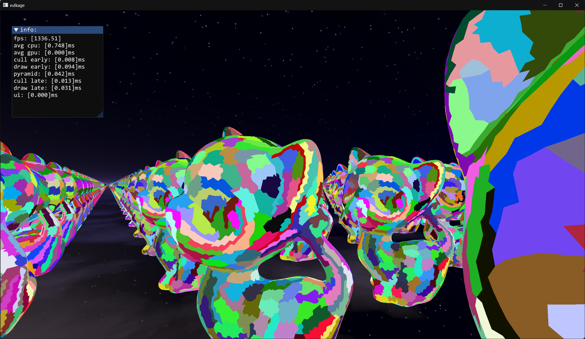
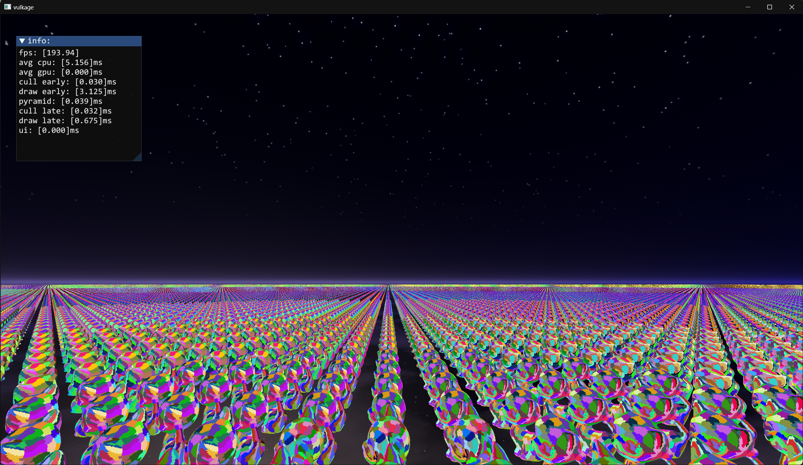
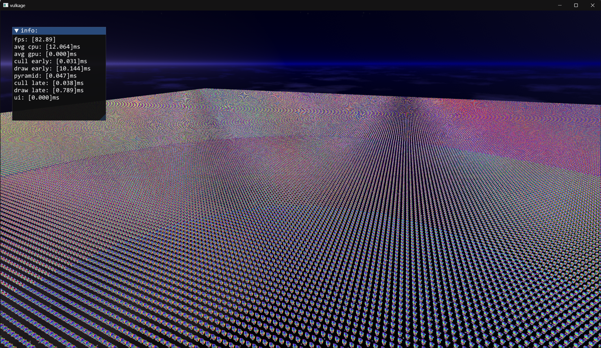

# vulkage

This project was setup by following the [mesh shading implementation](https://www.youtube.com/playlist?list=PL0JVLUVCkk-l7CWCn3-cdftR0oajugYvd) streaming via Arseny Kapoukine

Now mostly follow the **bgfx** style with my own rough understanding to do the abstraction.

It is a playground to understand modern graphics programming better.

----------

#### Depends

- volk
- meshoptimizer
- tracy
- glfw
- imgui
- bx
- bimg
- bgfx_common
- glm
- premake5

----------

#### niagara part(The streaming by Arseny Kapoukine):

Supports:

- mesh-shading
- task-submission
- Lod
- mesh level occlusion
- mesh-let level occlusion
- frustum culling
- back-face culling

-----------

#### vulkage part:

`` leash the vulkan in cage ``

- frame graph
  - sort and clip unnecessary passes and resources based on the contribution to the final result.
  - auto barrier: intend to record the resource state and transform states and layouts atomically.
  - auto alias: alias transition buffers if their lifetime is not overlapped. (Note: images are not been processed yet because a more specific condition required)
    
- gfx api abstraction
  - vulkan
- profiling
  - based on Tracy

------------

#### Build and Run:

1. download [premake5](https://premake.github.io/download/) and install it first.

2. clone the repo via:

   `git clone https://github.com/teassy000/vulkage.git`
3. enter the root directory by: 

   `cd vulkage`
4. update sub-modules via : 

   `git submodule update --init --recursive`
5. generate project with command: 

   `premake5 vs2022 x64`

   you can find the solution file in `./build/vulkage.sln`

Note: The project tested with vs2022 and worked on Nvidia 3070+ serials card. And it used the vulkan extension: `VK_EXT_mesh_shader`, default vertex pipeline might not work due to no testing for it.

----------

#### reference

- [Niagara streaming](https://www.youtube.com/playlist?list=PL0JVLUVCkk-l7CWCn3-cdftR0oajugYvd)  - Arseny Kapoukine
- [FrameGraph: Extensible Rendering Architecture in Frostbite](https://www.gdcvault.com/play/1024612/FrameGraph-Extensible-Rendering-Architecture-in)  - Yuriy O'Donnell
- [Advanced Graphics Tech: Moving to DirectX 12: Lessons Learned ](https://www.gdcvault.com/play/1024656/Advanced-Graphics-Tech-Moving-to) - Tiago Rodrigues
- [Render graphs](https://apoorvaj.io/render-graphs-1/) - Apoorva Joshi 
- [Vulkan Barriers Explained](https://gpuopen.com/learn/vulkan-barriers-explained/) - Matthäus Chajdas
- [Organizing GPU Work with Directed Acyclic Graphs](https://levelup.gitconnected.com/organizing-gpu-work-with-directed-acyclic-graphs-f3fd5f2c2af3) - Pavlo Muratov
- And Vulkan documents :)

---------

#### screen shots

