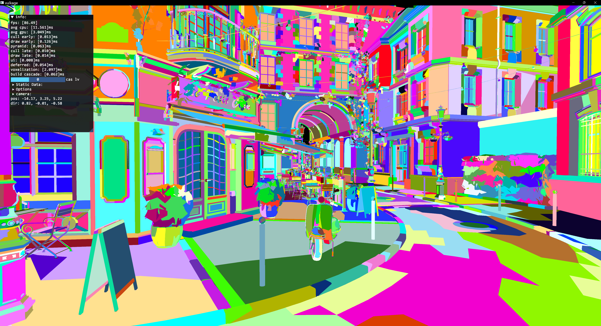
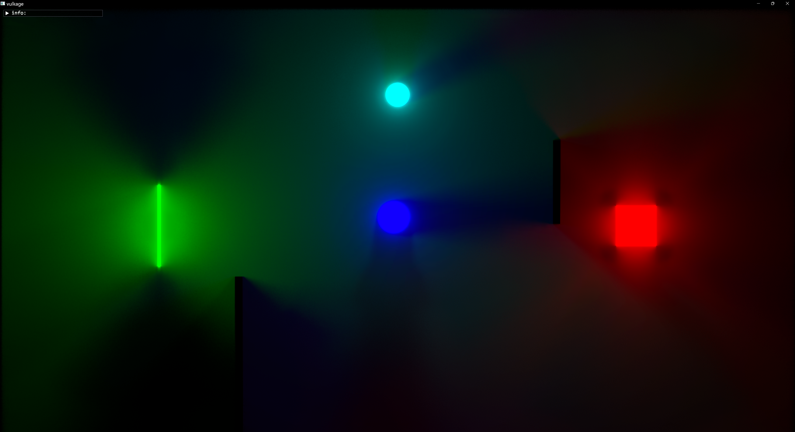

# vulkage

This project was setup by following the [mesh shading implementation](https://www.youtube.com/playlist?list=PL0JVLUVCkk-l7CWCn3-cdftR0oajugYvd) streaming via Arseny Kapoukine

Now mostly follow the **bgfx** style with my own rough understanding to do the abstraction.

It is a playground to understand modern graphics programming better.

----------

#### depends

- volk
- meshoptimizer
- tracy
- glfw
- imgui
- bx
- bimg
- bgfx_common
- glm
- METIS
- premake5
- FidelityFX
  - brixelizer


----------

#### niagara part(The streaming by Arseny Kapoukine):

supports:

- mesh-shading
- task-submission
- Lod
- mesh level occlusion
- meshlet level occlusion
- frustum culling
- back-face culling

-----------

#### vulkage part:

`` leash the vulkan in cage ``

- frame graph
  - sort and clip unnecessary passes and resources based on the contribution to the final result.
  - auto barrier: intend to record the resource state and transform states and layouts atomically.
  - auto alias: alias transition buffers if their lifetime is not overlapped. (Note: images are not been processed yet because a more specific condition required)

- gfx api abstraction
  - vulkan
- profiling
  - based on Tracy
- render command system
  - allow store the command then translate to platform API (e.g. vulkan)

- nanite style dynamic meshlet lod selection
- deferred rendering
- gltf scene loading
- bindless texture
- SMAA
- geometry shader based voxelization（with oct-tree optimized）
- radiance cascade 2D
- FidelityFX Brixelizer intergrate

------------

#### prepare:

1. download [premake5](https://premake.github.io/download/) and install it first.

5. generate project with command: 

   `premake5 vs2022 x64`

   you can find the solution file in `./build/vulkage.sln`

#### build:

1. build METIS manually

   1. open the `./externs/metis/include/metis.h`, then un-comment following macros(or set by your needs):

      ```
      // ...
      #define IDXTYPEWIDTH 32
      // ...
      #define REALTYPEWIDTH 32f
      ```

   2. generate the solution via ./externs/metis/vsgen.bat

   3. build the metis solution

2. build the vukage solution

3. set the project `vulkage` as startup

#### run: 

Working dir: `./`

`project_root$> vulkage.exe [model_dir] [-p]`

`[-p]` : Force parse the gltf model. The project will parse the model file once and dump the medium data to reduce loading time. 

#### notes: 

> a) METIS lib should be compiled manually.
>
> b) You should prepare models by yourself
>
> c) Start from `demo.cpp` if you like to read the code.
>
> d) The project tested with vs2022 and tested on **Nvidia 3070** serials, and should work on newer Nvidia cards(not sure if AMD supports mesh shaders on retail drivers yet). The project used the vulkan extension: `VK_EXT_mesh_shader`, default vertex pipeline might not work because I didn't setup the test project yet, it might broken due to some modification.

----------

#### references:

- [Niagara streaming](https://www.youtube.com/playlist?list=PL0JVLUVCkk-l7CWCn3-cdftR0oajugYvd)  - Arseny Kapoukine
- [FrameGraph: Extensible Rendering Architecture in Frostbite](https://www.gdcvault.com/play/1024612/FrameGraph-Extensible-Rendering-Architecture-in)  - Yuriy O'Donnell
- [Advanced Graphics Tech: Moving to DirectX 12: Lessons Learned ](https://www.gdcvault.com/play/1024656/Advanced-Graphics-Tech-Moving-to) - Tiago Rodrigues
- [Render graphs](https://apoorvaj.io/render-graphs-1/) - Apoorva Joshi 
- [Vulkan Barriers Explained](https://gpuopen.com/learn/vulkan-barriers-explained/) - Matthäus Chajdas
- [Organizing GPU Work with Directed Acyclic Graphs](https://levelup.gitconnected.com/organizing-gpu-work-with-directed-acyclic-graphs-f3fd5f2c2af3) - Pavlo Muratov
- [Radiance Cascades](https://drive.google.com/file/d/1L6v1_7HY2X-LV3Ofb6oyTIxgEaP4LOI6/view) - Alexander Sannikov
- [RC bilinear ring fix](https://arxiv.org/pdf/2408.14425) - C. M. J. Osborne, A. Sannikov
- [RC fundamental](m4xc.dev/articles/fundamental-rc/) - MΛX
- And Vulkan documents :)

---------

#### screen shots







